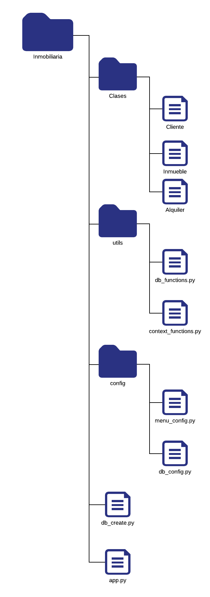

<h1>Inmobiliaria de alquileres :house_with_garden:</h1>
<h3> Universidad de Mendoza</h3>
<p> Pequeño software de administracion de inmobiliaria de alquileres, con el cual podremos 
agregar, modificar, y llevar cuenta de distintas propiedades clientes y alquileres. 
</p>
<hr>


<h3> Recursos utilizados: </h3>
<ul>
    <li> <a href="https://www.python.org/">Python 3</a> - Lenguaje de programacion
    <li> <a href="https://www.mysql.com/">MySQL</a> - SGBD
    <li> <a href="https://www.sqlalchemy.org/">SQLAlchemy</a> - ORM
    <li> <a href="https://docs.python.org/3/howto/curses.html">curses</a> - Modulo para imprimir menu
</ul>

<hr>
<h3> Estructura del proyecto</h3>
<p> Diagrama de entidad relacion </p>


<br>
<p>Diagrama de clases</p>


<p>Estructura</p>



<p>~735 lineas de codigo</p>


<br>
<br>

<hr>

<h3> Como ejecutar? </h3>
<h5> Requisitos </h5>
<ul>
<li> Sistema operativo Linux (por ahora)
<li> Tener instalado Python 3
<li> Tener instalado MySQL
</ul>
<h5> Pasos </h5>
<ul>

<li> :wrench: Crear entorno virtual. Dentro del directorio del proyecto ejecutar
    
```
python3 -m venv .
```

<li> Activar entorno virtual. Dentro del directorio del proyecto ejecutar

```
source bin/activate
```
<li> :wrench: Instalar requerimientos. Con el entorno activado ejecutar

```
pip install -r requeriments.txt
```

<li> :wrench: Crear archivo .env con la configuracion de tu base de datos MySQL

```
vi .env
```
Pegar lo siguiente en el archivo y completarlo con las confuguraciones de tu base de datos <br><br>
export DB_CONECTION=Tu_usuario:TuContraseña<br>
export DB_SCHEMA=NombreDeTuBase<br>
export DB_HOST=HostDeTuBase
<br><br>
Guardar el archivo
<li> :wrench: Ejecutar archivo db_create para generar las tablas y relaciones en la base de datos

```
python3 db_create.py
```
    
<li> Ejecutar archivo app

```
python3 app.py
```


</ul> 

Los pasos que contienen  :wrench: son de configuracion y solo tendras que llevarlos a cabo la primera vez

<hr>

<h3>Conclusion</h3>

<p> Problemas con los que me encontre :x:</p>
<ul>
    <li> Idea inicial
    <li> Dependencia ciruclar
    <li> Fechas
</ul>
<p> Aspectos positivos :heavy_check_mark:</p>
<ul>
    <li> git branch / git merge
    <li> UML
</ul>

<p> Reconocimientos :recycle: </p>
<ul>
    <li> <a href="https://github.com/nikhilkumarsingh"> Nikhil Kumar Singh </a>
    <li> <a href="https://pythonista.io/cursos/py121/introduccion-a-sql-alchemy"> Pythonista.io </a>
    <li> <a href="https://www.lucidchart.com/pages/es"> Lucidchart </a>
</ul>
